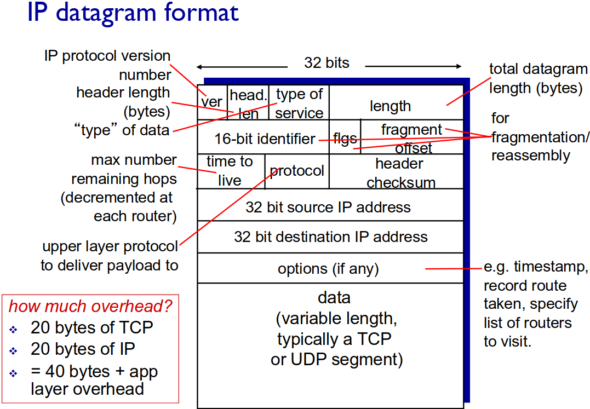
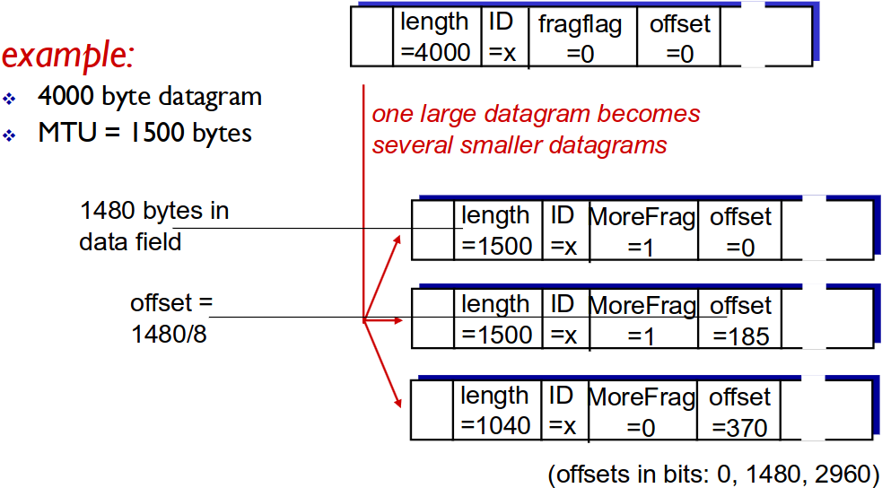

# Capitulo 4 - Camada de Rede

 1. Introduction
 2. Virtual Circuit and Datagram Networks
 3. IP: Internet Protocol
 4. Routing Algorithms

## Network Layer

- Transponha o segmento da origem para o host de destino;
- O lado que envia encapsula os segmentos nos datagramas;
- O destino entrega segmentos para a camada de transporte;
- Protocolos da camada de rede em cada host, router;
- Router examina cabeçalhos fiéis em todos os datagramas IP que passam por ele;

#### Duas funções chaves do network-layer

- __Forwarding__ - Move pacotes do input do router para o output do router;
- __Routing__ - Determina a rota que os pacotes iram fazer deste da origem ate o destino;

## Virtual Circuit

A rede fornece serviço de conexão de camada de rede

*"O caminho origem-destino se comporta muito semlhantemente com um circuito telefônico"*

- Desempenha sabiamente
- Ações de rede ao longo do caminho da origem ao destino

__VC implementation__

Consiste em:

 1. Caminho origem para o destino;
 2. Números VC, um número para cada link no caminho;
 3. Entradas em tabelas de encaminhamento em roteadores ao longo do caminho;

O pacote pertence ao VC que carrega o número do VC (não o endereço de destino). O número do VC pode ser alterado em cada link.

__Signalling protocols__

São usados para configurar, manter e desmontar VC. Eles são usados em redes ATM ou frame-relay. Isso não é usado na Internet de hoje.

__Datagram networks__

Estes não precisam de nenhuma chamada de configuração na camada de rede. Os roteadores não têm nenhum estado para duvidar das conexões de ponta a ponta (sem conceito de nível de rede de "conexão"). Os pacotes são usaando o endereço do host de destino.

__Tabelas de encaminhamento__

IP pega na rota que fizer match mais longo. Exemplo:

Destination Address Range  | Link interface
-------------------------- | --------------
110010000001011100010....... | 0
110010000001011100011000.... | 2
110010000001011100011....... | 3
otherwise | 3

**DA** : 110010000001011100011000*111010100001* 
**DA** : 110010000001011100011000*100010101010* *WHICH INTERFACE?*

O primeiro exemplo corresponde á interface 2 e o segundo exemplo corresponde á interface 1, apesar de também dar match na interface 2.

### Datagram or VC network: Porque?

|  Internet Datagram| ATM (VC) |
|:---:|:---:|
|  Troca de dados entre computadores | Evoluiu da telefonia  |
|  Muitos tipos de link | Conversação humana, tempo restrito, requisitos de confiabilidade |
|  End systems "inteligentes" (computadores) | End systems "burros" |

## IP : Internet Protocol

| Names | Functions |
| :---: | :---: |
| Transport Layer | TCP, UDP|
| Network Layer| *routing protocols*, *IP Protocol* & *ICMP protocol*|
| Link Layer | --- |
| Physical Layer | --- |

- __Routing Protocol__
    - Seleciona caminho (RIP, OSPF, BGP) &harr; Tabela de encaminhamento;

- __IP Protocol__
    - Abordando convenções;
    - Formato de Datagrama;
    - Convenções de Manipulação de Pacotes;

- __ICMP Protocol__
    - Repor erros;
    - "Sinaliza" o router;

### ICMP: Internet Controll Message Protocol

Este protocolo é utilizado por router e hosts para comunicar com as camadas da rede, informar erros e solicitar/resposder a echo (através de pings).

Nas camadas da rede "acima" do IP: mensagem ICMP transportadas em datagramas IP.

*ICMP message:* type, code, checksum, description.\
ICMPv4 - RFC792; ICMPv6 - RFC4443

### Traceroute e ICMP

A origem envia uma serie de segmentos UDP para o destino.

- Primeiramente seta o TTL para 1; etc.;
- Número de portas improvaveis;

Quando o n conjunto de datagramas chega ao router n, o router descarta os datagramas e envia para a origem uma mensagens ICMP (tipo 11, codigo 0). As mensagens ICMP incluem onome do router e o endereço IP. \
Quando uma mensagem ICMP chega a origem grava o RTTs.

__Stopping Criteria__ : O segmento UDP eventualmente chega ao host destinado. O destino retorna a mensagem ICMP "port unreachable" (tipo 3, codigo 3) e a origem para.

### IP datagram format

Datagramas IP maiores do que 1500 bytes, vão ser fragmentados. Uma vez fragmentados, só vão ser reagrupados no destino.

## IP Addressing

*Router* -> equipamento interligação nivel 3;
*Switch* -> equipamento interligação nivel 2;

Este router possui 3 redes e 3 endereços IP cada um associado a sua interface:
- 223.1.1;
- 223.1.2;
- 223.1.3.

Os endereços estão associados as interfaces. \
exemplo: 223.1.1.1 = 11011111 00000001 00000001 00000001

Dos 32 bits, há uma parte que identifica a rede (ou sub-rede) e identifica a interface do host.

### IPV4

Valor binario sem sinal de 32 bits __(xxxxxxxx.xxxxxxxx.xxxxxxxx.xxxxxxxx)__ . Uma parte identifica a rede/sub-rede e a outra a interface do host nessa rede. Na internet cada endereço deve ser único. Esses endereços são distribuidos em 5 classes (A-E), essas classes são dadas pela IANA (Internet Assigned Number Authority).

| Class | Identifier | Network Address | Destinatary Address |
| :---: | :---: | :---: | :---: |
| A | 0 (1 bit) | 7 bits | 24 bits |
| B | 10 (2 bits) | 14 bits | 16 bits |
| C | 110 (3 bits) | 14 bits | 16 bits |
| D | 1110 (4 bits) |Multicast Address between 224.0.0.0 - 239.255.255.255  </td> | - |
| E | 11110 | Reserved for the future | - |

## CIDR - Classless InterDomain Routing

Padrão que com o endereço Ip retorna parte da sub-rede do endereço IP.

| Class | Binary | Decimal | CIDR |
| :---: | :---: | :---: | :---: |
| A | 11111111.00000000.00000000.00000000 | 255.0.0.0 | /8 |
| B | 11111111.11111111.00000000.00000000 | 255.255.0.0 | /16 |
| C | 11111111.11111111.11111111.00000000 | 255.255.0.0 | /24 |

Quando nao usamos classes, a mascara pode tomar qualquer valor, isto permite a criação de de sub-redes ou super-redes.

__Exemplo:__\
Consideremos o IP 130.1.5.1:
- Se for classe B a mascara for default é /16. Então o endereço da estação 5.1 da rede 130.1.0.0

Consideremos o IP 130.1.5.1/24:
- É o endereço da estação 1 da sub-rede 130.1.5.0;
- O subnetting é definido no espaço host ID (__\<network id>\<subnet id>\<host id>__)

## Subnetting

Numa sub-rede os hosts chegam fisicamente entre si sem a intervenção do router. PAra determinar as subredes, separa-se a ligação ao router, criando redes isoladas. Para ter comuicação entre sub-redes é obrigatório ter um router, com interface para a sua própria rede.

| Vantagens | Desvantagens |
| :---: | :---: |
| Permite uma melhor organização e gestão da rede | Reduz espaço de enderaçamento (vários endereços passam a não ser utilizáveis) |
| Permite introduzir mais niveis hierárquicos para routing | Gestão mais complexa |

## Supernetting

Trata-se das redes diretamente ligadas, tráfego interno, e rota por defeito. A rota por defeito tme de garantir acesso à rede onde o router está ligado. Neste caso é RTR. Nas redes internas só processos de saber que são acessiveis via RTR2.

## IP Routing

O router e a estação ambos têm as tabelas de encaminhamento (routing).

### Forwarding algorithm

É facilitada pelo endereçamento hierárquico. O endereço IP é: __a.b.c.d/m = X.Y__ (rede.estação)

- Usar máscara para extrair o endereço da rede __X__;
- Procurar entrada que melhor se ajuste a __X__. Se __X__ é local, entregar na interface __X.Y__ (entrega direta), senão usar __X__ para encaminhar para o próximo salto (next hop);
- A entrada por defeito (0.0.0.0/0 ou default) ajusta-se a todos os __X__;

### Estatico vs Dinamico

__Estatico:__ : Rota estatica é o administrador que as configura e são imuutaveis.\
É um esque bastante rigido, pouco flexivel, mas simples e consegue reduzir o tráfego na rede.

__Dinamico:__ : Rota dimanica, e atualizada ao longo do tempo. \
Os routers trocam informação de routing entre si. Implementam protocolos especificos (RIP, OSPF, BGP, etc.). Tem uma grande flexibilidade e adapta-se de forma automática a falas ou mudanças ma configuração da rede. O tráfego da atualização pode causar sobrecarga na rede.

### Caminho por defeito

É a rota a seguir caso não exista uma entrada especifica na tabela para a rede de destino. Caso particular do encaminhamento estático.

### Computação dinâmica das rotas

__Centralizada__ : Cada router, conhecendo a topologia da area, de termina o melhor caminho para os possiveis destinos dessa rede.

__Distribuida__ : Cada router, envia informação de encaminhamento que conhece aos routers seus vizinhos (redes a que dá acesso).

## NAT - Network Address Translation

__Motivação__ :  A rede local usa apenas um endereço IP no que diz respeito ao mundo externo.

- Um endereeço IP público pode ser usado para todos os dispositvos (depois endereços privados);
- Pode alterar endereços de dispositivos na rede local;
- Pode mudar o ISP sem mudar os endereços dos dispositivos;

__Implementação__ : 

- __Datagramas de saída__: substiruit (endereço IP da origem, numeor da porta) de cada datagrama de saída (endereço IP NAT, novo numero da porta);
- __Lembrar__ que (na tabela de tradução NAT) cada (endereço IP da origem, numero da porta) para (endereço IP NAT, novo numero da porta) par de tradução;
- __Datagramas recebidos__: substituir (endereço IP NAT, novo numero da porta) de cada datagrama recebido (endereço IP da origem, numero da porta) armazenado na tabela NAT;

Campo de número de porta de 16 bits, conexões simultâneas de 60k com um único endereço do lado da LAN, o NAT é controverso, o roteador deve processar apenas até a camada 3 e viola o argumento de ponta a ponta (precisa ser levado em consideração pelos designers de aplicativos). A falta de endereço deve ser ser resolvido por IPv6.

## IPv6

__Motivação__ : O espaço de endereçamento do IPv4 é limitado e o IPv6 é a solução para o esgotamento de endereços. Extensão do endereço de 32 bits para 128 bits.

__Formado do Datagrama__

- Tamanho fixo de 40 bytes de header;
- Sem fragmentação premitida, por defeito;
    - __Traffic Class__ : Tem prioridade comparado aos outros datagramas;
    - __Flow Label__ : Identifica o fluxo de datagramas;
    - __Next Header__ : Identifica o protocolo da camada superior;

### IPv6 vs IPv4

- __Checksum__ : Removido inteiramente para reduzir o tempo de processamento em cada salto;
- __Options__ : Permitidas, mas fora do header, indicadas pelo campo "Next Header";
- __ICMPv6__ : Novo formato de mensagem ICMP;