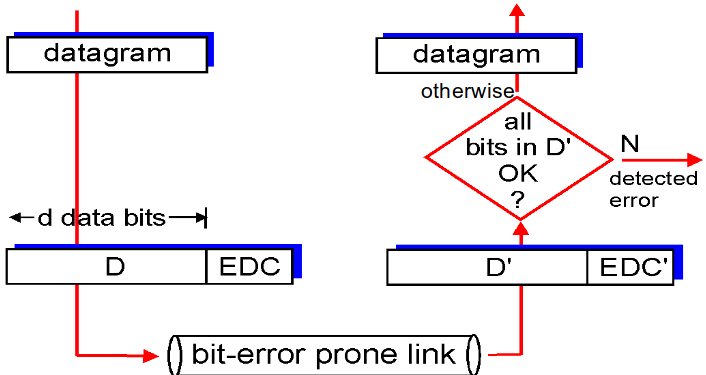

# Capitulo 6 - Link Layer

 1. Terminology & Context
 2. Error detection, correction
 3. Multiple Acess Protocols
 4. LANs

## Terminology

- Hosts e routers: nodes
- Canais de comunicação que conectam os nós adjacentes ao longo do caminho de comunicação: links
    - wired links;
    - wireless links;
    - LANs.
- Pacote de  nivel 2 de camada : frame, encapsula o datagrama;

## Context

Respondabilidade é diferente do nível do IP. Transfere um datagrama de um node para outro que seja fisicamente adjacente.

__Framing__: encapsula o que o nivel 3 passa numa unidade de dados nivel 2 (frame). Endereço MAC é também endereço físico. 

__Controlo de fluxo__: Serviço generico que pode existir no nivel 2. Regula a cadência entre nós adjacentes. Um que envia e outro que recebe. 

__Controlo de erros__: 2 tarefaas: deteção e correção de erros. Posso receber uma entrega não fíavel e simplesmente descartar, sem corrigir. Códigos de correção são muito pouco usados porque possuem overhead muito grande. Utilizam-se então códigos de retransmissão. Redes cabeladas têm muitos poucos erros e é possivel que nem tenham coidgo de detenção de erros. Redes WI-FI, como o meio é muito mais suscetível a erros, o código de detenção de erros está sempre presente. 

__Half-duplex e Full-duplex__: Half-duplex são bidirecionais alternadas (ou transmite um ou transmite outra) e Full-duplex são simultâneas. 

__Error detection__: Deteção de erros é feita através de um código de deteção de erros. O emissor adiciona bits de deteção de erros ao frame. O receptor recebe o frame e verifica se os bits de deteção de erros estão corretos. Se não estiverem, o frame é descartado.

## Error detection, correction

EDC = Error Detection and Correction bits (redundant bits) = Datos protegidos por error checking, podem incluor header fields

Tem noção que o error detection não é 100% fiável! Estes protocolos podem não detetar erros, mas é raro. Longos EDC são mais fiáveis que curtos.

## Multiple Acess Protocols

Existem dois tipos de links

- Point-to-point :
    - PPP para dial-up; HLDC point-to-point ou multiponto;
    - Point-to-point link entre Ethernet switch e host;
- Broadcast (shared wire or medium):
    - Ethernet antigo;
    - upstream HFC (Hybrid Fiber Coax);
    - 802.11 wireless LAN;

Único canal compartilhado de broadcast. Duas ou mais transmissões simultâneas por nós = interferência. Irá decorrer colisão se dois ou mais nós transmitirem ao mesmo tempo.

__Multiple Acess Protocol__ : É um algoritmo que determina como os nós compartilham o canal. A comunicação sobre o compartilhamento de canal deve ser no próprio canal.

_Um ideal Multiple Acess Protocol_

Um protocolo de acesso múltiplo ideal

Dado: canal de transmissão de taxa R bps

 1. Quando um nó deseja transmitir, ele pode enviar na taxa R
 2. Quando M nodos querem transmitir, cada um pode enviar na taxa média R/M
 3. Totalmente descentralizado:
    - nenhum nó especial para coordenar as transmissões
    - sem sincronização de relógios, slots
 4. simples

 ## MAC protocols

O maior desafio é quando há um meio de difusão: um meio partilhado em que qualquer estação pode aceder ao meio e uma vez acedendo ao meio, todas as outras têm a possibilidade de ouvir e receber a trama que está a ser transmitida.

__Colisão__ - se um nodo recebe 2 ou mais sinais ao mesmo tempo. As trama vão ser recebidas com erro. Para regulamentar este acesso, utilizam-se protocolos de acesso multiplo. Uma regra base é que este controlo siga feito usando o próprio canal de comunicação. "Inbad channel"

__Taxonomia__ - esquema de classificação dos protocolos. 3 classes génericas:
    - *Channel Partition* - canal é dividido em pequenas unidades. Os protocolos alocam pequenos traços de capacidade da ligação para uso exclusivo de um determinado nodo.
    - *Random acess* -  canal não é dividido e, não sendo dividido, há a possibilidade de ocorrem colisões. Vai haver uma forma de recuperar dessas colisões.
    - *Taking turns* - passagem de "tokens" de uns nodos para outros.

###Channel Partition

__TDMA__: Método livre de contentação. A capacidade do canal é, numa primeira estância, dividida em "time frames", e cada time frame dividido em slots. O acesso vai sendo feito dentro de cada time frame. Cada estação obtém a um time slot fixo, que normalmente corresponde ao tempo de transmissão de pacote. Slots que não sejam usados por estações não são reusados por outras estações. Vão para um estado de "idle".

