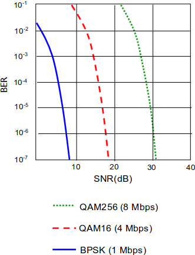
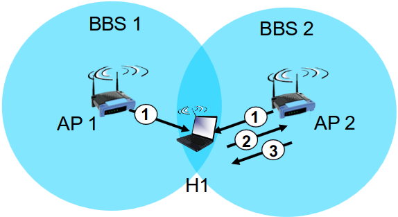
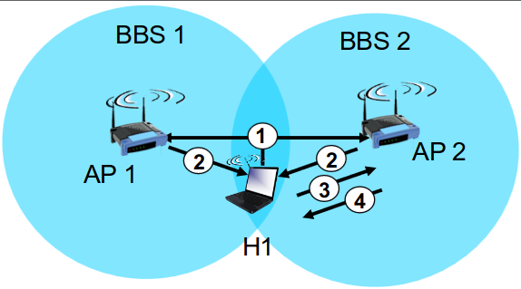

# Capitulo 7 - Wireless LANs

## Caracteristicas das redes sem fios

__Redes sem fios__: modo \
__Infraestrutura__: obrigatoriamente uma ligaçao a uma infrasestrutura. H´a a possibilidade entre areas. Pode tambem funcionar em modo __ad hoc__ (nos so podem comunicar se tiveram dentro da area de cobertura). 

Os sinais atraves do ar e obstaculos sao significativamente atenuados, ha um decrescismo da força de sinal (contrariamente ao que acontece a sinais cabelados). E, portanto, este meio e mais suscetiveis a sofrer interferencias. A banda de 2.4 GHz e uma banda onde funcionam muitos dispositos, havendo uma grande interferencia. O sinal de radio reflete-se em paredes, obstaculos, etc., chegando ao destino com pequenos desfaçamnetos - __Multipath Propagation__.

__SNR__: (Signal to Noise Ratio) - Relaçao sinal ruido. Quanto mais forte for o sinal mais facil ´e extrair o ruido e ficar com o sinal limpo. \
__BER__: (Bit Error Rate) - Bits errados face aos bits transmitidos. O objetivo ´e que seja o mais baixo possivel. ´E possivel diminuir o BER se aumentar a potencia do sinal. Mas tambem ´e possivel reduzir o debito (banda) de forma a manter o BER em niveis baixos.

## IEEE 802.11 Wireless LANs (Wi-Fi)

Todas usam CSMA/CA para acesso multiplo. ´E um metodo de controlo de acesso especifico de redes wi-fi; \
*Base Station* = Acess Point (AP); \
*Basic Service Set (BSS)* = Area de cobertura QUE ESTA A SER SERVIDA POR UM PARTICULAR AP; 

Um host para poder operar tem de se associar ao AP. Faz *scanning* dos varios canais ou entao pode ir recebendo "beacon frames" (beacons) que sao enviadas pelos AP que informam sobre o nome de AP (SSID) e o MAC address. O host, apos a receçao de becons, seleciona um AP ´a qual se vai associar.

__Scanning Passivo__: feito quando o host H1 toma conhecimento das caracteristicas da BSS atraves de beacons. Estes sao enviados do AP para as STA's. Com base nesses beacons, a estaç~ao H1 escolhe qual o AP a que se vai associar. 

__Scanning Ativo__: o host H1 envia um probe request em broadcast e os AP's que est~ao nas imediaç~oes respondam- probe response.

### Acessos multiplos

CSMA, escuta o meio antes de transmitir. Ha situaçoes em que a colisao nao ´e detetada de forma eficaz. Num meio wireless, nao conseguimos ter garantia de qualidade do sinal que a estaçao recetora est´a a ter uma vez que se podem receber sinais muito fracos. Portanto, os que o 802.11 decidiu foi que nao uam fazer detençao de colisao mas sim evitar colisoes (CSMA/CA).

__802.11 sender__: ha um tempo inicial que o sender tem que de esperar antes de começar a transmitir (DIFS: 28-50 micro segundos). Depois desta espera, transmite a trama integralmente sem fazer deteçao de colisao. Se o meio esta ocupado, a estaçao nao fica de forma persistente a tentar enviar o sinal. Começa o "random backoff time" e otimer conta enquanto o canal esta inativo. Se nao recebeu o ACK, aumenta o "backoff time" e volta a entrar no ciclo de espera. Se recebeu o ACK, o ciclo termina.

__802.11 receiver__: espera SIFS (10-16 micro segundos) e se a trama ´e recebida, envia um positivo ackledgement. Se este ACK  nao chega, ´e porque houve erro.

